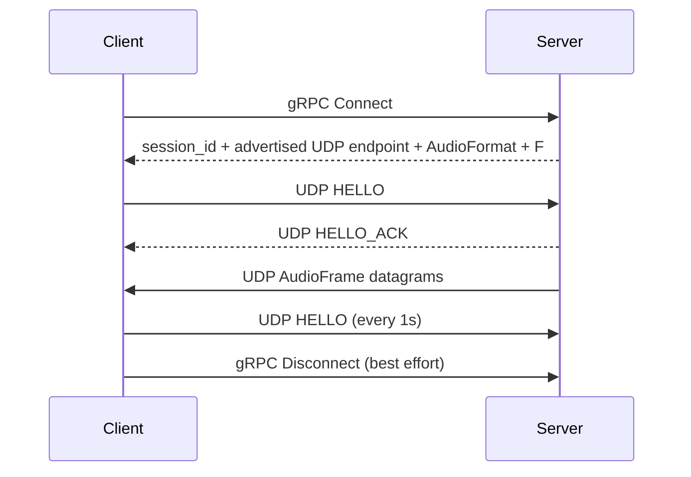

# Aqua

[English](README.md)  |  [中文](README_zh.md)

> Cross-platform-oriented, low-latency network audio streaming. The current repository provides a working Windows/WASAPI
> implementation: capture PCM on one device, transmit it through a gRPC-controlled UDP session, and play it back on
> another device.


Aqua deliberately separates a small control plane from the real-time audio data plane. gRPC establishes the session and
delivers the audio geometry; UDP carries one complete PCM `AudioFrame` per datagram; the Client JitterBuffer turns
irregular network arrival into a continuous playback timeline.

Device failures do not kill a session. Both ends can rebuild their audio endpoint in place: the Server re-opens capture
through `CaptureManager`, the Client re-opens playback through `PlaybackManager`. The session, the negotiated format and
the sequence timeline all survive the switch.

The repository currently ships two production-ready implementations: **Windows desktop** (WASAPI capture + playback,
delivered as CLIs) and **Android playback** (AAudio playback + a Kotlin/Compose app bridged through the stable C API
`aqua_capi`). Both share the same Core — `ClientRuntime`, JitterBuffer, and the gRPC+UDP data plane behave identically.
Linux/macOS keep build skeletons; their audio backends are not implemented yet.

## ✨ Features

**Audio**

- Windows WASAPI capture with `input` and `loopback` sources
- Windows WASAPI playback
- Uncompressed PCM: S16LE / S24LE / S32LE / F32LE / U8
- Variable-length capture blocks repackaged into fixed-size `AudioFrame` slots
- Automatic MTU-safe `frame_count` selection
- Loopback starvation fallback: a quiescent WASAPI loopback source can be represented as synthetic silence without
  creating a second Packetizer producer

**Device switching**

- A device failure is a switch, not a shutdown: the endpoint is rebuilt in place, the session stays alive
- Candidate chain per switch: `target device` → `previously active device` → `system default`
- Routing modes: follow the system default, or pin a specific device and switch back automatically when it returns
- Format is immutable: a candidate that cannot satisfy the session format is simply skipped
- Bounded retries: at most 3 automatic restarts per 10 s window, then the session is stopped
- Only device events count — silence or low energy is never treated as "the device is broken"

**Networking**

- gRPC control plane for `Connect` / `Disconnect`
- Raw UDP data plane; protobuf is not used on the audio hot path
- UDP `HELLO` / `HELLO_ACK` session establishment and 1-second keepalive
- Session timeout and periodic reaping
- IPv4 and IPv6 literal address handling
- Server bind address is independent from the UDP endpoint advertised to Clients
- Client-side `--force-udp-port` override for NAT / port mapping deployments

**Playback quality**

- Fixed-capacity, sequence-indexed JitterBuffer
- Startup pre-roll
- Deadline-based late and missing frame handling
- Warning-zone soft timeline correction
    - low water: replay READY slots to slow the playback timeline
    - high water: skip complete slots to speed the playback timeline
- Warning correction grows gradually and is capped
- Deadline correction and reanchor provide hard recovery paths
- Missing frames produce silence instead of blocking playback
- Detailed jitter, loss, reanchor, silence, and playback diagnostics

**Diagnostics and CLI**

- 1-second diagnostic snapshots from both CLIs
- Optional JitterBuffer realtime debug logging for short development investigations
- WASAPI capture Active / Silent / Starved diagnostics
- Device enumeration with endpoint direction and default format
- UTF-8-safe Windows console and error reporting

**Android**

- AAudio playback backend: LOW_LATENCY / SHARED; encoding and channel count must match the server contract, sample rate
  may be resampled by the system, framesPerCallback adapts to the device burst
- Stable C API (`aqua_capi`): opaque handle, poll-style state / diagnostics / connect_result queries, serial lifecycle
  contract
- Kotlin/Compose app: user-level metric cards on the home screen, advanced parameters at CLI parity (jitter slots /
  HELLO interval / UDP port override / log level / client name), foreground service with MediaStyle notification,
  audio focus, UI-layer auto-reconnect
- Playback device picker: the full device list is available before connecting, choose "follow system" or pin one
  device; a pinned device is switched back to automatically once it reappears
- The native library `libaqua.so` is cross-compiled from the root CMake; gRPC/protobuf/abseil are statically linked
  into the single artifact together with the JNI dynamic registration

## How it works



Server and Client data paths:

```text
Server
  WASAPI Capture (RT / MMCSS)   ← owned by CaptureManager (rebuilt on device failure)
        │
        ▼
  AudioBlock
        │
        ▼
  AudioPacketizer
        │
        ▼
  AudioFrameQueue (SPSC handoff)
        │
        ▼
  AudioNetworkDispatcher
        │
        ▼
  UDP broadcast
        │
        ▼
Client UDP receive
        │
        ▼
  JitterBuffer::push
        │
        ▼
  JitterBuffer::pull (playback RT)
        │
        ▼
  WASAPI Playback   ← owned by PlaybackManager (rebuilt on device failure)
```

A switch is a stop → start transaction on the control thread. The packetizer, queue, dispatcher, sessions and the
JitterBuffer are never rebuilt, so the sequence timeline simply continues.

An important implementation fact is that **AudioPacketizer has no private worker thread**. Its `push()` runs on the
Server capture realtime thread, which is registered with MMCSS Pro Audio. The SPSC `AudioFrameQueue` is the handoff
point to the non-realtime network dispatcher.

## Current platform status

| Platform | Capture                 | Playback | Status                                            |
|----------|-------------------------|----------|---------------------------------------------------|
| Windows  | WASAPI input / loopback | WASAPI   | ✅ implemented                                        |
| Linux    | —                       | —        | 🟡 build skeleton; audio backends not implemented     |
| Android  | —                       | AAudio   | ✅ playback implemented (capture pending, see roadmap) |
| macOS    | —                       | —        | 🟡 build skeleton; audio backends not implemented     |

The Linux/macOS presets are build infrastructure, not evidence that those platform audio backends are complete.

## Quick start

### Prerequisites

- CMake ≥ 4.2
- vcpkg in manifest mode (`VCPKG_ROOT`)
- Windows: Visual Studio 2026

### Build and test

```powershell
cmake --preset windows-x64-debug
cmake --build cmake_build/windows-x64-debug --config Debug
ctest --test-dir cmake_build/windows-x64-debug --build-config Debug --output-on-failure
```

Release:

```powershell
cmake --preset windows-x64-release
cmake --build cmake_build/windows-x64-release --config Release
```

### Run

Server can start with no arguments:

```powershell
.\aqua_server_cli.exe
```

Default Server configuration:

```text
server-ip              0.0.0.0
rpc-port               50051
udp-port               50000
capture                loopback
capture device         system default OUTPUT endpoint
advertise-ip           follows server-ip unless explicitly set
advertise-udp-port     follows udp-port unless explicitly set
```

Client requires only the Server's reachable IP:

```powershell
.\aqua_client_cli.exe --server-ip 192.168.1.10
```

Default Client configuration:

```text
server-rpc               50051
UDP endpoint             obtained from gRPC Connect
playback device          system default OUTPUT endpoint
playback format          Server-provided AudioFormat
jitter-slots             30
client name              aqua-client
```

For a NAT or port-mapping deployment, only the UDP port normally needs a client-side override:

```powershell
.\aqua_client_cli.exe --server-ip 192.168.1.10 --force-udp-port 52000
```

Useful commands:

```powershell
.\aqua_server_cli.exe --help
.\aqua_server_cli.exe --list-devices
.\aqua_client_cli.exe --help
.\aqua_client_cli.exe --list-devices
```

Server capture semantics:

```text
--capture input
    capture an INPUT endpoint, such as a microphone

--capture loopback
    capture the mixed audio of an OUTPUT endpoint using WASAPI loopback
```

An INPUT endpoint cannot be used with `--capture loopback`, and an OUTPUT endpoint cannot be used with
`--capture input`.

### Android

Prerequisites: the NDK (`ANDROID_NDK_HOME`), vcpkg `arm64-android` dependencies (triggered automatically by the preset
on first configure), and a JDK / Android SDK.

```powershell
# 1. Cross-compile the native library and sync it into per-buildType jniLibs
powershell -ExecutionPolicy Bypass -File aqua_app/aqua_android/build_android.ps1

# 2. Package the APK with Gradle
cd aqua_app/aqua_android
.\gradlew.bat assembleDebug    # or assembleRelease
```

Artifacts land in `aqua_app/aqua_android/app/build/outputs/apk/<debug|release>/`. Release signing is read from
`aqua_app/aqua_android/keystore.properties` (not committed; falls back to debug signing when absent).

Install on a device (wireless debugging):

```powershell
adb -s <device> install -r app\build\outputs\apk\release\app-release.apk
```

See [BUILD.md](BUILD.md) for details.

## Network and audio invariants

Aqua intentionally keeps its wire and timing rules strict:

- one complete `AudioFrame` per UDP Audio datagram;
- Audio wire header = 9 bytes;
- UDP audio PCM payload budget = 1443 bytes, chosen to remain safe for a 1500-byte IPv6 MTU;
- `frame_count` is fixed for one Server run and is delivered to Client through gRPC;
- Server does not implicitly resample or transcode;
- Client constructs its playback chain from the Server-provided format;
- JitterBuffer capacity is measured in slots, not milliseconds;
- realtime audio paths must not block, allocate dynamically, or perform synchronous I/O;
- a device switch keeps the session alive, keeps the format, and never resets the sequence timeline (a packet gap is
  allowed; a sequence reset is not).

For the detailed rationale, state transitions and edge cases, see `aqua_core/doc/`.

## Documentation

| Document                                                                                           | Purpose                                                        |
|----------------------------------------------------------------------------------------------------|----------------------------------------------------------------|
| [aqua_core/doc/architecture.md](aqua_core/doc/architecture.md)                                     | Overall architecture, boundaries, data flow and lifecycle      |
| [aqua_core/doc/flow_model.md](aqua_core/doc/flow_model.md)                                         | Connection, steady state, failure and shutdown flows           |
| [aqua_core/doc/audio_design.md](aqua_core/doc/audio_design.md)                                     | Audio units, format policy, capture/playback semantics and MTU |
| [aqua_core/doc/buffer_design.md](aqua_core/doc/buffer_design.md)                                   | JitterBuffer geometry, correction and recovery                 |
| [aqua_core/doc/protocol.md](aqua_core/doc/protocol.md)                                             | gRPC/UDP protocol, session and wire format                     |
| [aqua_core/doc/capture_switching_design.md](aqua_core/doc/capture_switching_design.md)             | Server-side capture device switching decisions                 |
| [aqua_core/doc/playback_switching_design.md](aqua_core/doc/playback_switching_design.md)           | Client-side playback device switching decisions                |
| [aqua_core/doc/threading_and_lifecycle.md](aqua_core/doc/threading_and_lifecycle.md)               | Thread ownership, callbacks and stop order                     |
| [aqua_core/doc/configuration_reference.md](aqua_core/doc/configuration_reference.md)               | Current defaults and fixed protocol values                     |
| [aqua_core/doc/testing.md](aqua_core/doc/testing.md)                                               | Test strategy and regression scope                             |
| [aqua_core/doc/operations_and_troubleshooting.md](aqua_core/doc/operations_and_troubleshooting.md) | Runtime troubleshooting                                        |
| [aqua_core/doc/modules/source_map.md](aqua_core/doc/modules/source_map.md)                         | Source-to-document navigation                                  |
| [aqua_core/doc/android_roadmap.md](aqua_core/doc/android_roadmap.md)                               | Android layering, milestones, and acceptance criteria          |
| [aqua_core/doc/aaudio_backend_design.md](aqua_core/doc/aaudio_backend_design.md)                   | AAudio format negotiation and device routing decisions         |
| [aqua_app/cli/doc/README.md](aqua_app/cli/doc/README.md)                                           | CLI-specific documentation                                     |

The Core documentation describes the current implementation. When documents disagree, source code and tests take
precedence.

## Project structure

```text
aqua/
├── CMakeLists.txt
├── CMakePresets.json
├── aqua_core/
│   ├── include/aqua/       # public Core headers (c_api/ holds the stable C boundary)
│   ├── src/                # Core implementation (c_api/ includes the Android JNI bridge)
│   ├── proto/              # gRPC / protobuf schema
│   ├── tests/              # GoogleTest suites
│   └── doc/                # Core design and maintenance docs
└── aqua_app/
    ├── aqua_android/       # Android app (Compose / Service / jniLibs)
    │   ├── app/            # Kotlin sources and the Gradle project
    │   └── build_android.ps1  # native cross-compile + strip + jniLibs sync
    └── cli/                # Server / Client CLI
        ├── cli_parser/     # typed CLI configuration parsing
        └── doc/            # CLI documentation
```

## Scope and non-goals

The current Core intentionally does not include:

- audio codecs or compression;
- automatic resampling or transcoding;
- WASAPI Exclusive mode;
- runtime **format** hot switching (devices are switchable; the format and F are fixed for one Server run);
- a runtime API to change the capture target on the Server (the target is the CLI configuration);
- STUN/TURN/ICE NAT traversal;
- public-internet authentication or a secure UDP protocol;
- a second playback ring buffer behind the JitterBuffer.

Future Linux/macOS backends should reuse the current Core contracts instead of introducing a second runtime
architecture. Subsequent Android milestones (capture / loopback) are tracked in `aqua_core/doc/android_roadmap.md`;
note that Android system APIs do not provide OUTPUT loopback, so a capture server's internal-recording capability
needs separate design.

## Development note

Some code and documentation were AI-assisted and human-reviewed. The authoritative project state is the current source
tree, tests, and Core documentation.

## License

Distributed under the [MIT License](LICENSE).
