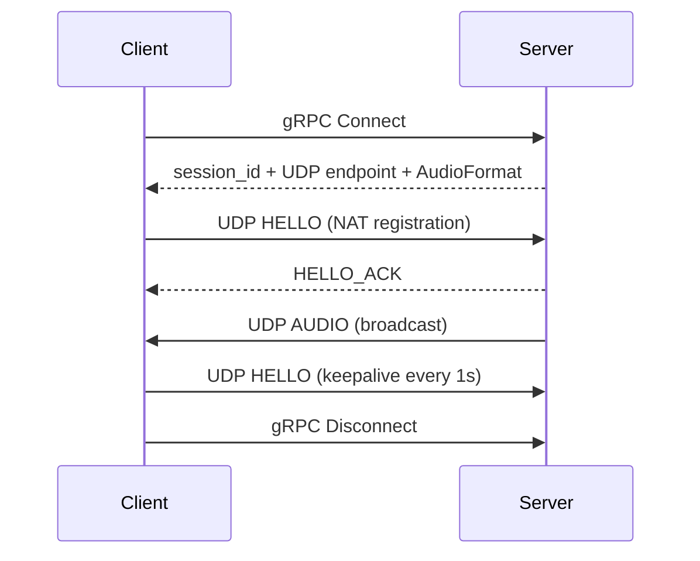

# Aqua

> Cross-platform, low-latency network audio streaming. Capture PCM audio on one device and play it back in real time on
> another.


Aqua pipes audio between devices over the network — for example, stream a PC's audio to a phone or to another computer.
It is built for **low latency** and **simplicity**: a thin gRPC control plane plus a raw-UDP audio path.

## ✨ Features

**Audio**

- WASAPI loopback capture (Windows) and AAudio playback (Android)
- Uncompressed PCM — S16LE / S32LE / F32LE / S24LE / U8
- SPSC ring buffer isolating the real-time audio callback from the network

**Networking**

- Raw UDP data plane — compact binary packets, no protobuf on the hot path
- gRPC control plane (`Connect` / `Disconnect` only)
- One-layer NAT traversal via UDP `HELLO` handshake + keepalive (no STUN/TURN/ICE)

**Playback quality**

- Jitter buffer with playout-deadline reordering, deduplication, and late/loss handling
- Adaptive target latency and packet-loss concealment
- Playback-rate drift diagnostics (ppm)

**Integration**

- Stable C API (`include/aqua.h`) between the C++ core and any UI
- Android foreground media service — MediaSession, notification controls, audio focus

## How it works



> **gRPC manages connections, SessionManager manages state, UDP carries audio, the Audio Backend talks to devices, and
the client handles its own format conversion.**

The server is a pure relay — it never resamples, transcodes, or mixes.

## Platform support

| Platform | Capture         | Playback           | Status      |
|----------|-----------------|--------------------|-------------|
| Windows  | WASAPI loopback | WASAPI             | ✅          |
| Android  | mic (planned)   | AAudio             | ✅ playback |
| Linux    | —               | PipeWire (planned) | ⬜          |
| macOS    | —               | —                  | ⬜ planned  |

## Quick start

### Prerequisites

- CMake ≥ 4.2 and [vcpkg](https://vcpkg.io) (dependencies in `vcpkg.json`)
- Windows: Visual Studio; Android: NDK + SDK

### Build

```powershell
# Windows desktop (server + client CLI)
cmake --preset windows-x64-debug
cmake --build cmake_build/windows-x64-debug --config Debug
ctest --test-dir cmake_build/windows-x64-debug --build-config Debug --output-on-failure

# Android (build the native lib first, then the APK)
powershell -ExecutionPolicy Bypass -File Android/build_android.ps1
cd Android; .\gradlew.bat assembleDebug    # or assembleRelease
```

### Run

```powershell
# Server
aqua_server --bind-ip 0.0.0.0 --rpc-port 50051 --udp-port 50000

# Client (the UDP port is returned by gRPC Connect — no CLI flag needed)
aqua_client --server-ip <server_ip> --server-rpc-port 50051
```

## Tech stack

| Layer         | Technology                         |
|---------------|------------------------------------|
| Core          | C++23, CMake, vcpkg                |
| Data plane    | Asio (UDP)                         |
| Control plane | gRPC + Protocol Buffers            |
| Audio         | WASAPI (Windows), AAudio (Android) |
| Desktop UI    | Qt6 (planned)                      |
| Android UI    | Kotlin + Jetpack Compose           |
| Logging       | spdlog                             |
| Tests         | GoogleTest                         |

## Project structure

```text
aqua/
├── include/aqua.h            # C API header
├── proto/                    # gRPC control-plane proto
├── src/
│   ├── core/                 # platform-independent core + audio backends
│   ├── app/cli/              # server/client CLI
│   └── android/jni/          # JNI bridge
├── Android/                  # Android app (Kotlin/Compose)
├── tests/                    # unit & integration tests
└── doc/                      # design docs
```

## Documentation

| Doc                                                      | Description           |
|----------------------------------------------------------|-----------------------|
| [BUILD.md](BUILD.md)                                     | Build guide           |
| [doc/architecture.md](doc/architecture.md)               | Architecture & design |
| [doc/protocol.md](doc/protocol.md)                       | Wire protocol         |
| [doc/modules.md](doc/modules.md)                         | Modules & interfaces  |
| [doc/roadmap.md](doc/roadmap.md)                         | Milestones & status   |
| [doc/diagnostics_manager.md](doc/diagnostics_manager.md) | Diagnostics           |

## Roadmap

PCM over UDP is stable end-to-end. In flight: Linux (PipeWire), Android mic capture, Qt6 desktop UI, and the Opus codec.
See [doc/roadmap.md](doc/roadmap.md) for details.

## Notes

> **Note:** Some modules of this project are written by AI and reviewed by humans.

## License

Distributed under the [MIT License](LICENSE).
