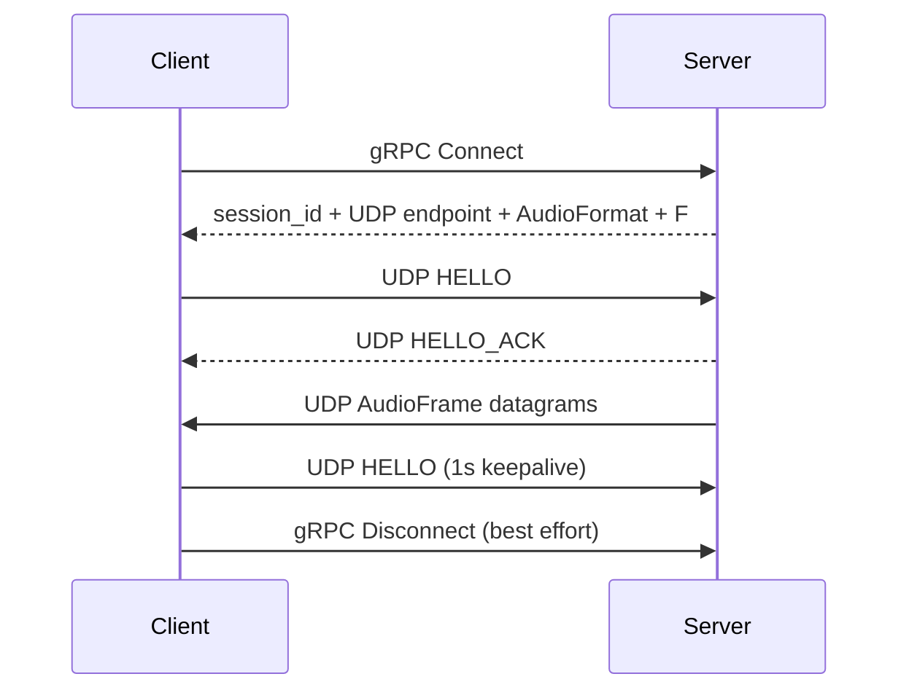

# Aqua

[English](README.md)  |  [中文](README_zh.md)

> Stream the sound playing on one device to another device on your LAN — in real time, with low latency.


[](https://github.com/aquawius/aqua)

Aqua is a LAN audio streaming system: a Server captures the local sound (system mix or microphone), and a Client
plays it back in real time on another device. Audio travels as uncompressed PCM with no transcoding, so on a LAN you
get lossless quality and controlled latency.

Two implementations are production-ready today:

- **Windows desktop**: `aqua_server_cli` + `aqua_client_cli`, ready-to-use command-line programs;
- **Android phone**: a Kotlin/Compose app that acts as a receiver, playing your PC's sound on the phone.

## What you can do

- **Stream your PC's sound to a phone or another PC**: the Server captures the mix of the default output device
  (loopback) by default — connect a phone and listen.
- **Capture a microphone instead**: `--capture input` switches to an input endpoint.
- **Switch devices without dropping the stream**: unplugging headphones or changing the system default output does
  not kill the session — both ends rebuild their audio endpoint on the new device automatically, with no reconnect.
- **Pin a specific device**: `--device-id` keeps using one device as long as it exists.
- **Uncompressed, untranscoded**: PCM as-is (S16LE / S24LE / S32LE / F32LE / U8); the Server never implicitly
  resamples.
- **Live diagnostics**: both CLIs emit per-second jitter / loss / device-state metrics; the Android app shows
  user-level metric cards on its home screen.
- **Android receiver**: playback device picker (follow system or pin one device, with automatic switch-back when it
  returns), foreground service for background playback, audio focus handling, auto-reconnect, and advanced
  parameters at CLI parity (jitter slots / HELLO interval / UDP port override / log level).

## Technical highlights

**Audio and transport**

- Windows WASAPI capture (`input` / `loopback`) and playback; uncompressed PCM: S16LE / S24LE / S32LE / F32LE / U8
- Variable-length capture blocks repackaged into fixed-size `AudioFrame` slots; MTU-safe `frame_count` derived
  automatically
- Quiescent WASAPI loopback compensated with synthetic silence, without creating a second Packetizer producer
- gRPC control plane (`Connect` / `Disconnect`) + raw UDP data plane; no protobuf on the audio hot path
- UDP `HELLO` / `HELLO_ACK` session establishment, 1-second keepalive, session timeout and periodic reaping
- **IPv4 / IPv6 dual-stack** literal address handling; the Server's bind address is independent from the UDP
  endpoint advertised to Clients
- `--force-udp-port` client override for NAT / port-mapping deployments

**Playback quality**

- Fixed-capacity, sequence-indexed JitterBuffer: startup pre-roll, deadline-based late/missing frame handling
- Warning-zone soft correction: low water replays READY slots to slow the timeline, high water skips slots to speed
  it up; correction grows from 1 slot and is capped
- Deadline correction and reanchor provide hard recovery; missing frames produce silence instead of blocking the
  playback RT
- Full jitter / loss / reanchor / silence / playback diagnostics

**Diagnostics and CLI**

- Per-second diagnostic snapshots from both CLIs; WASAPI capture Active / Silent / Starved state diagnostics
- Device enumeration with endpoint direction and default format; UTF-8-safe Windows console and error reporting
- Optional JitterBuffer realtime debug logging for short development investigations

**Android**

- AAudio playback backend: LOW_LATENCY / SHARED; encoding and channel count strictly match the server contract,
  sample rate may be resampled by the system, framesPerCallback adapts to the device burst
- C API (`aqua_capi`): opaque handle, poll-style state / diagnostics / connect_result queries, serial
  lifecycle contract
- Kotlin/Compose app: user-level metric cards, foreground service with MediaStyle notification, audio focus,
  UI-layer auto-reconnect, advanced parameters at CLI parity
- `libaqua.so` cross-compiled from the root CMake, with gRPC / protobuf / abseil statically linked into a single
  artifact including JNI dynamic registration

## Quick start

### Prerequisites

- CMake ≥ 4.2, vcpkg in manifest mode (`VCPKG_ROOT`)
- Windows: Visual Studio 2026
- Android (optional): NDK (`ANDROID_NDK_HOME`), JDK / Android SDK

### Build and test

```powershell
cmake --preset windows-x64-debug
cmake --build cmake_build/windows-x64-debug --config Debug
ctest --test-dir cmake_build/windows-x64-debug --build-config Debug --output-on-failure
```

Release build:

```powershell
cmake --preset windows-x64-release
cmake --build cmake_build/windows-x64-release --config Release
```

### Run

The Server starts with no arguments (captures the default output device's mix by default; gRPC `50051` / UDP
`50000`):

```powershell
.\aqua_server_cli.exe
```

The Client only needs the Server's reachable IP:

```powershell
.\aqua_client_cli.exe --server-ip 192.168.1.10
```

Useful commands:

```powershell
.\aqua_server_cli.exe --help           # all options
.\aqua_server_cli.exe --list-devices   # enumerate audio devices
.\aqua_client_cli.exe --help
.\aqua_client_cli.exe --list-devices
```

Common scenarios:

```powershell
# Capture a microphone instead of the system mix
.\aqua_server_cli.exe --capture input

# Pin one capture device (find ids with --list-devices); if it disappears the Server stops
# instead of silently moving to another device
.\aqua_server_cli.exe --device-id "{...}"

# NAT / port-mapping deployment: only the UDP port normally needs an override
.\aqua_client_cli.exe --server-ip 192.168.1.10 --force-udp-port 52000
```

### Android app

```powershell
# 1. Cross-compile the native library and sync it into per-buildType jniLibs
powershell -ExecutionPolicy Bypass -File aqua_app/aqua_android/build_android.ps1

# 2. Package the APK with Gradle
cd aqua_app/aqua_android
.\gradlew.bat assembleDebug    # or assembleRelease
```

Artifacts land in `aqua_app/aqua_android/app/build/outputs/apk/<debug|release>/`. Release signing is read from
`keystore.properties` (not committed; falls back to debug signing when absent). See [BUILD.md](BUILD.md) for
details.

## Platform status

| Platform | Capture                 | Playback | Status                                           |
|----------|-------------------------|----------|--------------------------------------------------|
| Windows  | WASAPI input / loopback | WASAPI   | ✅ implemented                                   |
| Android  | —                       | AAudio   | ✅ playback implemented (capture: see roadmap)   |
| Linux    | —                       | —        | 🟡 build skeleton; audio backends not implemented |
| macOS    | —                       | —        | 🟡 build skeleton; audio backends not implemented |

The Linux/macOS presets mean the build infrastructure is ready, not that the platform audio backends are done.

---

## How it works

Aqua deliberately separates a **small control plane** from the **real-time audio data plane**:



gRPC only establishes/tears down sessions and delivers parameters; each UDP datagram carries exactly one complete
PCM `AudioFrame` with no protobuf on the hot path; the Client's JitterBuffer turns irregular network arrivals into a
continuous playback timeline.

```text
Server
  WASAPI Capture (RT / MMCSS)   ← owned by CaptureManager, rebuilt on failure
        │  AudioBlock (variable-length PCM view)
        ▼
  AudioPacketizer               ← no private thread; runs on the capture RT thread
        │  AudioFrame (fixed F frames)
        ▼
  AudioFrameQueue (SPSC handoff: RT → network thread)
        ▼
  AudioNetworkDispatcher ──► UDP broadcast ──► Client
                                                  │  decode + source-endpoint validation
                                                  ▼
                                            JitterBuffer (sequence-indexed slots, natural reordering)
                                                  │  pull (playback RT callback)
                                                  ▼
                                            WASAPI / AAudio Playback   ← owned by PlaybackManager, rebuilt on failure
```

**A device failure is a switch, not a shutdown.** Each end rebuilds its audio endpoint in place along a candidate
chain (`CaptureManager` / `PlaybackManager`); the gRPC session, UDP session, negotiated format and sequence timeline
all survive — a packet gap is allowed, a sequence reset is not. The switch transaction (stop → start) runs on the
control thread, never on the real-time path; the gap is absorbed by the Client-side JitterBuffer's water-level
mechanism.

Routing semantics are symmetric on both ends:

- **Follow system** (default): candidate chain `[target, previously active, system default]`, automatically follows
  system default device changes;
- **Pinned device**: on the Client, a pinned device that disappears falls back to system output and switches back
  when it returns; on the Server, an explicit `--device-id` means "only this device" — if it disappears the session
  goes Fatal and stops instead of silently degrading to the system default.

## Design notes (maintainers)

- **Format is immutable**: `AudioFormat` and `frame_count = F` are fixed for one Server run, delivered via gRPC, and
  never inferred by the Client. A candidate device that cannot natively satisfy the session format simply fails —
  no transcoding.
- **One datagram, one frame**: 9-byte audio wire header, 1443-byte PCM payload budget (derived from a 1500-byte
  IPv6 MTU).
- **A single buffer layer**: the Client has only the JitterBuffer, no second RingBuffer — two water levels and two
  consumption clocks would make drift behavior unexplainable.
- **Real-time discipline**: RT threads do bounded work only (memory copies / atomics / queue ops) — no blocking, no
  heap allocation, no synchronous I/O. `AudioPacketizer` has no private thread; its `push()` runs on the MMCSS
  `Pro Audio` capture thread.
- **JitterBuffer capacity is in slots, not milliseconds**: pre-roll starts anchored at 50% water level; low water
  replays READY slots to slow the timeline, high water skips slots to speed it up; soft correction grows gradually
  and is capped; deadline correction and reanchor provide hard recovery; missing frames produce silence instead of
  blocking playback.
- **Bounded retries**: at most 3 automatic restarts per 10-second window, then the session stops — protecting
  against plug/unplug storms.
- **Only device events count**: silence or low energy is never treated as "the device is broken" (a quiescent
  WASAPI loopback source is compensated with synthetic silence frames).
- **Security boundary**: UDP HELLO carries no authentication, audio datagrams carry no identity, gRPC is plaintext —
  Aqua is a trusted-LAN protocol. Do not expose it to the public internet. See
  `aqua_core/doc/security_and_deployment.md`.

## Documentation

The Core documentation describes **the system as currently implemented in source** and is the primary entry point
for maintaining this project (navigation: [aqua_core/doc/README.md](aqua_core/doc/README.md)):

| Document                                                                                           | Purpose                                                        |
|----------------------------------------------------------------------------------------------------|----------------------------------------------------------------|
| [architecture.md](aqua_core/doc/architecture.md)                                                   | Overall architecture, boundaries, data flow and lifecycle      |
| [flow_model.md](aqua_core/doc/flow_model.md)                                                       | Connection, steady state, failure and shutdown flows           |
| [audio_design.md](aqua_core/doc/audio_design.md)                                                   | Audio units, format policy, capture/playback semantics and MTU |
| [buffer_design.md](aqua_core/doc/buffer_design.md)                                                 | JitterBuffer geometry, correction and recovery                 |
| [protocol.md](aqua_core/doc/protocol.md)                                                           | gRPC/UDP protocol, session and wire format                     |
| [capture_switching_design.md](aqua_core/doc/capture_switching_design.md)                           | Server-side capture device switching decisions                 |
| [playback_switching_design.md](aqua_core/doc/playback_switching_design.md)                         | Client-side playback device switching decisions                |
| [devices_and_format.md](aqua_core/doc/devices_and_format.md)                                       | Device value objects, routing and format relationships         |
| [threading_and_lifecycle.md](aqua_core/doc/threading_and_lifecycle.md)                             | Thread ownership, callbacks and stop order                     |
| [design_decisions.md](aqua_core/doc/design_decisions.md)                                           | Frozen design decisions                                        |
| [configuration_reference.md](aqua_core/doc/configuration_reference.md)                             | Current defaults and fixed protocol values                     |
| [diagnostics.md](aqua_core/doc/diagnostics.md)                                                     | Logging and diagnostics metrics                                |
| [testing.md](aqua_core/doc/testing.md)                                                             | Test strategy and regression scope                             |
| [build_and_release.md](aqua_core/doc/build_and_release.md)                                         | Build, presets, dependencies and release checks                |
| [operations_and_troubleshooting.md](aqua_core/doc/operations_and_troubleshooting.md)               | Runtime troubleshooting                                        |
| [project_scope_and_requirements.md](aqua_core/doc/project_scope_and_requirements.md)               | Project scope, non-goals and product invariants                |
| [security_and_deployment.md](aqua_core/doc/security_and_deployment.md)                             | Trust model and deployment limits                              |
| [android_roadmap.md](aqua_core/doc/android_roadmap.md)                                             | Android layering, milestones, and acceptance criteria          |
| [aaudio_backend_design.md](aqua_core/doc/aaudio_backend_design.md)                                 | AAudio format negotiation and device routing decisions         |
| [modules/](aqua_core/doc/modules/source_map.md)                                                    | Source-level module docs (source_map is the navigation entry)  |
| [aqua_app/cli/doc/README.md](aqua_app/cli/doc/README.md)                                           | CLI-specific documentation                                     |

When documents disagree, source code and tests take precedence.

## Project structure

```text
aqua/
├── CMakeLists.txt / CMakePresets.json / vcpkg.json
├── aqua_core/
│   ├── include/aqua/       # public Core headers (c_api/ holds the stable C boundary)
│   ├── src/                # Core implementation (c_api/ includes the Android JNI bridge)
│   ├── proto/              # gRPC / protobuf schema
│   ├── tests/              # GoogleTest suites
│   └── doc/                # Core design and maintenance docs
└── aqua_app/
    ├── aqua_android/       # Android app (Kotlin/Compose + build_android.ps1)
    └── cli/                # Server / Client CLI (cli_parser + topic docs)
```

Server and Client compile as separate targets (`aqua_server_core` / `aqua_client_core`) so platform backend
dependencies never propagate to the other end. `aqua_capi` is off by default and enabled by the Android preset,
producing a single `libaqua.so` with gRPC/protobuf/abseil statically linked.

## Scope and non-goals

The current Core intentionally does not include:

- audio codecs or compression (raw PCM);
- automatic resampling or transcoding;
- WASAPI / AAudio Exclusive mode;
- runtime **format** hot switching (devices are switchable; the format and F are fixed for one Server run);
- a runtime API to change the Server's capture target (the target is the CLI configuration);
- STUN/TURN/ICE NAT traversal;
- authentication or encryption — not a public-internet secure protocol;
- a second playback ring buffer behind the JitterBuffer.

Future Linux/macOS backends should reuse the current Core contracts instead of introducing a second runtime
architecture. Subsequent Android milestones (capture etc.) are tracked in `aqua_core/doc/android_roadmap.md`;
Android system APIs do not provide OUTPUT loopback, so internal-recording capability needs a separate design.

## Development note

This project contains AI-assisted, human-reviewed code and documentation. When maintaining it, treat the current
source tree, tests, and the implementation state described in the Core technical documentation as authoritative.

## License

Distributed under the [MIT License](LICENSE).
