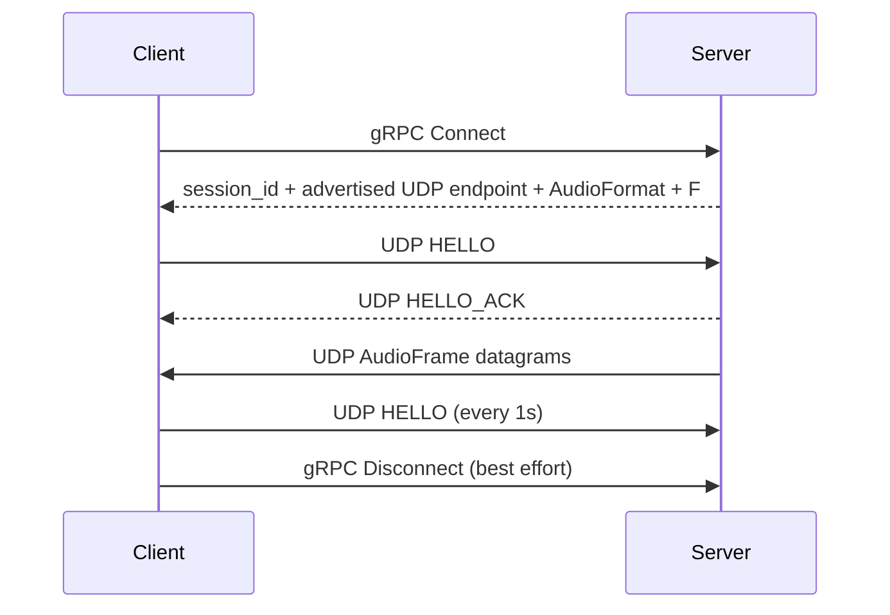

# Aqua

[English](README.md)  |  [中文](README_zh.md)

> Cross-platform-oriented, low-latency network audio streaming. The current repository provides a working Windows/WASAPI implementation: capture PCM on one device, transmit it through a gRPC-controlled UDP session, and play it back on another device.


Aqua deliberately separates a small control plane from the real-time audio data plane. gRPC establishes the session and delivers the audio geometry; UDP carries one complete PCM `AudioFrame` per datagram; the Client JitterBuffer turns irregular network arrival into a continuous playback timeline.

The current Core is focused on Windows desktop operation. Platform abstractions exist so future backends can reuse the same contracts, but the repository currently implements WASAPI audio backends only.

## ✨ Features

**Audio**

- Windows WASAPI capture with `input` and `loopback` sources
- Windows WASAPI playback
- Uncompressed PCM: S16LE / S24LE / S32LE / F32LE / U8
- Variable-length capture blocks repackaged into fixed-size `AudioFrame` slots
- Automatic MTU-safe `frame_count` selection
- Loopback starvation fallback: a quiescent WASAPI loopback source can be represented as synthetic silence without creating a second Packetizer producer

**Networking**

- gRPC control plane for `Connect` / `Disconnect`
- Raw UDP data plane; protobuf is not used on the audio hot path
- UDP `HELLO` / `HELLO_ACK` session establishment and 1-second keepalive
- Session timeout and periodic reaping
- IPv4 and IPv6 literal address handling
- Server bind address is independent from the UDP endpoint advertised to Clients
- Client-side `--force-udp-port` override for NAT / port mapping deployments

**Playback quality**

- Fixed-capacity, sequence-indexed JitterBuffer
- Startup pre-roll
- Deadline-based late and missing frame handling
- Warning-zone soft timeline correction
  - low water: replay READY slots to slow the playback timeline
  - high water: skip complete slots to speed the playback timeline
- Warning correction grows gradually and is capped
- Deadline correction and reanchor provide hard recovery paths
- Missing frames produce silence instead of blocking playback
- Detailed jitter, loss, reanchor, silence, and playback diagnostics

**Diagnostics and CLI**

- 1-second diagnostic snapshots from both CLIs
- Optional JitterBuffer realtime debug logging for short development investigations
- WASAPI capture Active / Silent / Starved diagnostics
- Device enumeration with endpoint direction and default format
- UTF-8-safe Windows console and error reporting

## How it works



Server and Client data paths:

```text
Server
  WASAPI Capture (RT / MMCSS)
        │
        ▼
  AudioBlock
        │
        ▼
  AudioPacketizer
        │
        ▼
  AudioFrameQueue (SPSC handoff)
        │
        ▼
  AudioNetworkDispatcher
        │
        ▼
  UDP broadcast
        │
        ▼
Client UDP receive
        │
        ▼
  JitterBuffer::push
        │
        ▼
  JitterBuffer::pull (playback RT)
        │
        ▼
  WASAPI Playback
```

An important implementation fact is that **AudioPacketizer has no private worker thread**. Its `push()` runs on the Server capture realtime thread, which is registered with MMCSS Pro Audio. The SPSC `AudioFrameQueue` is the handoff point to the non-realtime network dispatcher.

## Current platform status

| Platform | Capture | Playback | Status |
|----------|---------|----------|--------|
| Windows | WASAPI input / loopback | WASAPI | ✅ implemented |
| Linux | — | — | 🟡 build skeleton; audio backends not implemented |
| Android | — | — | 🟡 roadmap only |
| macOS | — | — | 🟡 build skeleton; audio backends not implemented |

The non-Windows presets are build infrastructure, not evidence that those platform audio backends are complete.

## Quick start

### Prerequisites

- CMake ≥ 4.2
- vcpkg in manifest mode (`VCPKG_ROOT`)
- Windows: Visual Studio 2026

### Build and test

```powershell
cmake --preset windows-x64-debug
cmake --build cmake_build/windows-x64-debug --config Debug
ctest --test-dir cmake_build/windows-x64-debug --build-config Debug --output-on-failure
```

Release:

```powershell
cmake --preset windows-x64-release
cmake --build cmake_build/windows-x64-release --config Release
```

### Run

Server can start with no arguments:

```powershell
.\aqua_server_cli.exe
```

Default Server configuration:

```text
server-ip             0.0.0.0
rpc-port              50051
udp-port              50000
capture               loopback
capture device         system default OUTPUT endpoint
advertise-ip           follows server-ip unless explicitly set
advertise-udp-port     follows udp-port unless explicitly set
```

Client requires only the Server's reachable IP:

```powershell
.\aqua_client_cli.exe --server-ip 192.168.1.10
```

Default Client configuration:

```text
server-rpc             50051
UDP endpoint             obtained from gRPC Connect
playback device          system default OUTPUT endpoint
playback format          Server-provided AudioFormat
jitter-slots             30
client name              aqua-client
```

For a NAT or port-mapping deployment, only the UDP port normally needs a client-side override:

```powershell
.\aqua_client_cli.exe --server-ip 192.168.1.10 --force-udp-port 52000
```

Useful commands:

```powershell
.\aqua_server_cli.exe --help
.\aqua_server_cli.exe --list-devices
.\aqua_client_cli.exe --help
.\aqua_client_cli.exe --list-devices
```

Server capture semantics:

```text
--capture input
    capture an INPUT endpoint, such as a microphone

--capture loopback
    capture the mixed audio of an OUTPUT endpoint using WASAPI loopback
```

An INPUT endpoint cannot be used with `--capture loopback`, and an OUTPUT endpoint cannot be used with `--capture input`.

## Network and audio invariants

Aqua intentionally keeps its wire and timing rules strict:

- one complete `AudioFrame` per UDP Audio datagram;
- Audio wire header = 9 bytes;
- UDP audio PCM payload budget = 1443 bytes, chosen to remain safe for a 1500-byte IPv6 MTU;
- `frame_count` is fixed for one Server run and is delivered to Client through gRPC;
- Server does not implicitly resample or transcode;
- Client constructs its playback chain from the Server-provided format;
- JitterBuffer capacity is measured in slots, not milliseconds;
- realtime audio paths must not block, allocate dynamically, or perform synchronous I/O.

For the detailed rationale, state transitions and edge cases, see `aqua_core/doc/`.

## Documentation

| Document | Purpose |
|----------|---------|
| [aqua_core/doc/architecture.md](aqua_core/doc/architecture.md) | Overall architecture, boundaries, data flow and lifecycle |
| [aqua_core/doc/flow_model.md](aqua_core/doc/flow_model.md) | Connection, steady state, failure and shutdown flows |
| [aqua_core/doc/audio_design.md](aqua_core/doc/audio_design.md) | Audio units, format policy, capture/playback semantics and MTU |
| [aqua_core/doc/buffer_design.md](aqua_core/doc/buffer_design.md) | JitterBuffer geometry, correction and recovery |
| [aqua_core/doc/protocol.md](aqua_core/doc/protocol.md) | gRPC/UDP protocol, session and wire format |
| [aqua_core/doc/threading_and_lifecycle.md](aqua_core/doc/threading_and_lifecycle.md) | Thread ownership, callbacks and stop order |
| [aqua_core/doc/configuration_reference.md](aqua_core/doc/configuration_reference.md) | Current defaults and fixed protocol values |
| [aqua_core/doc/testing.md](aqua_core/doc/testing.md) | Test strategy and regression scope |
| [aqua_core/doc/operations_and_troubleshooting.md](aqua_core/doc/operations_and_troubleshooting.md) | Runtime troubleshooting |
| [aqua_core/doc/modules/source_map.md](aqua_core/doc/modules/source_map.md) | Source-to-document navigation |
| [aqua_app/cli/doc/README.md](aqua_app/cli/doc/README.md) | CLI-specific documentation |

The Core documentation describes the current implementation. When documents disagree, source code and tests take precedence.

## Project structure

```text
aqua/
├── CMakeLists.txt
├── CMakePresets.json
├── aqua_core/
│   ├── include/aqua/       # public Core headers
│   ├── src/                # Core implementation
│   ├── proto/              # gRPC / protobuf schema
│   ├── tests/              # GoogleTest suites
│   └── doc/                # Core design and maintenance docs
└── aqua_app/
    └── cli/                # Server / Client CLI
        ├── cli_parser/     # typed CLI configuration parsing
        └── doc/            # CLI documentation
```

## Scope and non-goals

The current Core intentionally does not include:

- audio codecs or compression;
- automatic resampling or transcoding;
- WASAPI Exclusive mode;
- runtime device or format hot switching;
- STUN/TURN/ICE NAT traversal;
- public-internet authentication or a secure UDP protocol;
- a second playback ring buffer behind the JitterBuffer.

Future Linux/macOS/Android backends should reuse the current Core contracts instead of introducing a second runtime architecture.

## Development note

Some code and documentation were AI-assisted and human-reviewed. The authoritative project state is the current source tree, tests, and Core documentation.

## License

Distributed under the [MIT License](LICENSE).
