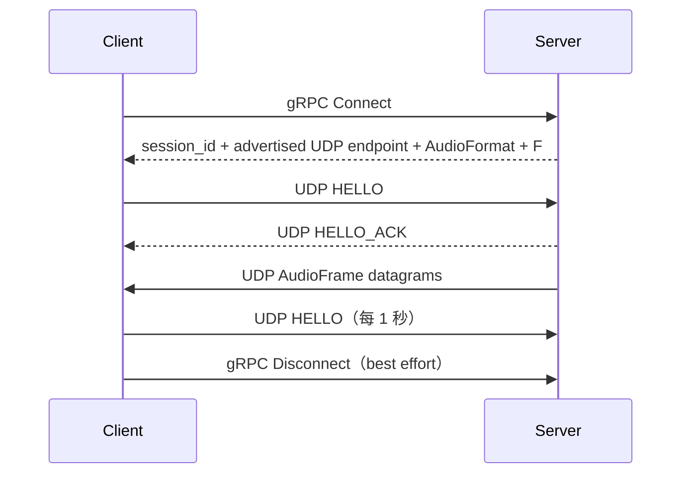

# Aqua

[English](README.md)  |  [中文](README_zh.md)

> 低延迟局域网网络音频共享系统：在一台设备上采集 PCM，通过由 gRPC 控制的 UDP 会话实时传输，在另一台设备上播放。


Aqua 刻意把系统拆成轻量控制面和实时音频数据面：gRPC 负责建立 session 并下发音频几何参数；UDP 每个 datagram 承载一个完整
PCM `AudioFrame`；Client 的 JitterBuffer 再把不规则的网络到达转换成连续的播放时间轴。

设备故障不等于会话终止：两端都能就地重建音频端点——Server 由 `CaptureManager` 重开采集，Client 由 `PlaybackManager` 重开播放。
切换过程中 session、协商好的格式与 sequence 时间线全部保留。

当前仓库包含两个实机可用的实现：**Windows 桌面**（WASAPI 采集 + 播放，CLI 交付）与 **Android playback**（AAudio 播放 +
Kotlin/Compose App，经稳定 C API `aqua_capi` 桥接同一 Core——`ClientRuntime` / JitterBuffer / gRPC+UDP 数据面与 CLI
完全一致）。Linux/macOS 保留构建骨架，音频后端尚未实现。

## ✨ 特性

**音频**

- Windows WASAPI 采集，支持 `input` 与 `loopback` 两种来源
- Windows WASAPI 播放
- 无压缩 PCM：S16LE / S24LE / S32LE / F32LE / U8
- 将变长 Capture Block 封装为固定尺寸的 `AudioFrame` slot
- 按 MTU 自动推导安全的 `frame_count`
- Loopback 事件饥饿 fallback：WASAPI loopback endpoint 进入 quiescence 时，可合成静音 `AudioBlock`，且不创建第二个
  Packetizer producer

**设备切换**

- 设备故障是"切换"而不是"停机"：就地重建端点，会话保持存活
- 每次切换走候选链：`目标设备` → `先前的实际设备` → `系统默认`
- 路由语义：跟随系统默认，或钉住指定设备（该设备回归后自动切回）
- 格式不可变：无法满足会话格式的候选设备直接跳过
- 有界重试：10s 窗口内最多 3 次自动 restart，超限才停止会话
- 只认设备事件：静音、低能量都不作为"设备坏了"的判据

**网络**

- gRPC 控制面：`Connect` / `Disconnect`
- 裸 UDP 数据面；音频热路径不使用 protobuf
- UDP `HELLO` / `HELLO_ACK` 建立 session，并每 1 秒保活
- Session 超时与周期回收
- IPv4 / IPv6 literal 地址处理
- Server 本地监听地址与通知 Client 的 UDP 地址可以独立设置
- Client 提供 `--force-udp-port`，用于 NAT / 端口映射等场景

**播放质量**

- 固定容量、按 sequence 编址的 JitterBuffer
- 启动 pre-roll
- 基于 playout deadline 的迟到、缺帧处理
- Warning 区软校正：
    - 低水位：重播 READY slot，减慢 playback timeline
    - 高水位：跳过完整 slot，加快 playback timeline
- Warning correction 从 1 slot 起逐步增长并受上限约束
- Deadline correction 与 reanchor 提供强制恢复路径
- 网络缺帧时输出静音，不阻塞 playback RT
- jitter、loss、reanchor、静音、播放等诊断指标

**诊断与 CLI**

- Server / Client 每 1 秒诊断 snapshot
- 可选 JitterBuffer realtime debug log，仅用于短时开发调查
- WASAPI Capture 的 Active / Silent / Starved 状态诊断
- 设备枚举、endpoint 方向和默认格式展示
- Windows CLI 与系统错误的 UTF-8 处理

**Android**

- AAudio 播放后端：LOW_LATENCY / SHARED；编码与声道严格匹配 Server 契约，采样率允许系统重采样，framesPerCallback
  自适应设备 burst
- 稳定 C API（`aqua_capi`）：opaque handle、轮询式 state / diagnostics / connect_result 查询，生命周期串行契约
- Kotlin/Compose App：主页用户级指标卡、高级参数（对齐 CLI：抖动槽数 / HELLO 间隔 / UDP 端口覆盖 / 日志级别 / 名称）、
  前台服务 + MediaStyle 通知、音频焦点、UI 层自动重连
- 播放设备选择：未连接即可查看完整设备列表；可选"跟随系统"或钉住某个设备，钉住的设备重新出现后自动切回
- native 库 `libaqua.so` 由根 CMake 交叉编译，gRPC/protobuf/abseil 静态链入单库交付，含 JNI 动态注册

## 工作原理



数据路径：

```text
Server
  WASAPI Capture（RT / MMCSS）   ← 由 CaptureManager 持有，故障时重建
        │
        ▼
  AudioBlock
        │
        ▼
  AudioPacketizer
        │
        ▼
  AudioFrameQueue（SPSC handoff）
        │
        ▼
  AudioNetworkDispatcher
        │
        ▼
  UDP broadcast
        │
        ▼
Client UDP receive
        │
        ▼
  JitterBuffer::push
        │
        ▼
  JitterBuffer::pull（playback RT）
        │
        ▼
  WASAPI Playback   ← 由 PlaybackManager 持有，故障时重建
```

切换是控制线程上的一次 stop → start 事务。packetizer、队列、dispatcher、session 与 JitterBuffer 都不重建，因此 sequence
时间线直接延续。

一个重要的实现事实是： **AudioPacketizer 没有自己的线程。** 它的 `push()` 直接运行在 Server Capture realtime thread
上，该线程已经注册 MMCSS `Pro Audio`。非实时网络线程从 `AudioFrameQueue` 开始。

## 当前平台状态

| 平台    | 采集                    | 播放    | 状态                                        |
|---------|-------------------------|---------|---------------------------------------------|
| Windows | WASAPI input / loopback | WASAPI  | ✅ 已实现                                   |
| Android | —                       | AAudio  | ✅ 播放已实现（capture 未实现，见 roadmap） |
| Linux   | —                       | —       | 🟡 有构建骨架，但音频后端未实现             |
| macOS   | —                       | —       | 🟡 有构建骨架，但音频后端未实现             |

Linux/macOS preset 表示构建基础设施，不代表对应平台音频后端已经完成。

## 快速开始

### 环境要求

- CMake ≥ 4.2
- vcpkg manifest 模式，并设置 `VCPKG_ROOT`
- Windows：Visual Studio 2026

### 构建与测试

```powershell
cmake --preset windows-x64-debug
cmake --build cmake_build/windows-x64-debug --config Debug
ctest --test-dir cmake_build/windows-x64-debug --build-config Debug --output-on-failure
```

Release：

```powershell
cmake --preset windows-x64-release
cmake --build cmake_build/windows-x64-release --config Release
```

### 运行

Server 无参数即可启动：

```powershell
.\aqua_server_cli.exe
```

Server 默认：

```text
server-ip              0.0.0.0
rpc-port               50051
udp-port               50000
capture                loopback
capture device         系统默认 OUTPUT endpoint
advertise-ip           未指定时跟随 server-ip
advertise-udp-port     未指定时跟随 udp-port
```

Client 最少只需要 Server 的可达 IP：

```powershell
.\aqua_client_cli.exe --server-ip 192.168.1.10
```

Client 默认：

```text
server-rpc               50051
UDP endpoint             从 gRPC Connect 获取
playback device          系统默认 OUTPUT endpoint
playback format          使用 Server 返回的 AudioFormat
jitter-slots             30
client name              aqua-client
```

NAT / 端口映射场景可以只覆盖 UDP port：

```powershell
.\aqua_client_cli.exe --server-ip 192.168.1.10 --force-udp-port 52000
```

常用命令：

```powershell
.\aqua_server_cli.exe --help
.\aqua_server_cli.exe --list-devices
.\aqua_client_cli.exe --help
.\aqua_client_cli.exe --list-devices
```

Server capture 语义：

```text
--capture input
    捕获 INPUT endpoint，例如麦克风

--capture loopback
    对 OUTPUT endpoint 使用 WASAPI loopback，捕获该设备的系统混音
```

OUTPUT endpoint 不能与 `--capture input` 搭配；INPUT endpoint 不能用于 `--capture loopback`。

### Android

前置：NDK（`ANDROID_NDK_HOME`）、vcpkg `arm64-android` 依赖（首次由 preset 自动触发）、JDK/Android SDK。

```powershell
# 1. 交叉编译 native 库并同步到 per-buildType jniLibs（debug/release 各一份）
powershell -ExecutionPolicy Bypass -File aqua_app/aqua_android/build_android.ps1

# 2. Gradle 打包 APK
cd aqua_app/aqua_android
.\gradlew.bat assembleDebug    # 或 assembleRelease
```

产物：`aqua_app/aqua_android/app/build/outputs/apk/<debug|release>/`。Release 签名从
`aqua_app/aqua_android/keystore.properties` 读取（不入 git，缺省回退 debug 签名）。

手机安装（无线调试）：

```powershell
adb -s <device> install -r app\build\outputs\apk\release\app-release.apk
```

详细说明见 [BUILD.md](BUILD.md)。

## 网络与音频不变量

Aqua 对数据面和音频时间轴采用严格约束：

- 一个 UDP Audio datagram 对应一个完整 `AudioFrame`
- Audio wire header = 9 bytes
- UDP 音频 PCM payload budget = 1443 bytes，该值按 IPv6 1500-byte MTU 计算
- 一个 Server 运行期间 `frame_count` 固定，并通过 gRPC 下发给 Client
- Server 不隐式重采样、不转码
- Client 根据 Server 的格式创建自己的播放链路
- JitterBuffer 容量以 slot 表示，而不是毫秒
- playback RT 与 capture RT 不等待网络条件
- 实时音频路径不得阻塞、动态分配或执行同步 I/O
- 设备切换保持会话存活、格式不变、sequence 时间线不重置（允许 packet gap，禁止 sequence 重置）

详细设计、状态机和边界见 `aqua_core/doc/`。

## 文档

| 文档                                                                                               | 作用                                          |
|----------------------------------------------------------------------------------------------------|-----------------------------------------------|
| [aqua_core/doc/architecture.md](aqua_core/doc/architecture.md)                                     | 总体架构、边界、数据流、生命周期              |
| [aqua_core/doc/flow_model.md](aqua_core/doc/flow_model.md)                                         | 连接、稳态、故障与关闭流程                    |
| [aqua_core/doc/audio_design.md](aqua_core/doc/audio_design.md)                                     | 音频单位、格式、采集/播放语义、MTU            |
| [aqua_core/doc/buffer_design.md](aqua_core/doc/buffer_design.md)                                   | JitterBuffer 几何、软校正、deadline、reanchor |
| [aqua_core/doc/protocol.md](aqua_core/doc/protocol.md)                                             | gRPC/UDP 协议、Session、wire format           |
| [aqua_core/doc/capture_switching_design.md](aqua_core/doc/capture_switching_design.md)             | Server 采集设备切换设计决议                   |
| [aqua_core/doc/playback_switching_design.md](aqua_core/doc/playback_switching_design.md)           | Client 播放设备切换设计决议                   |
| [aqua_core/doc/threading_and_lifecycle.md](aqua_core/doc/threading_and_lifecycle.md)               | 线程所有权、callback 与 stop 顺序             |
| [aqua_core/doc/configuration_reference.md](aqua_core/doc/configuration_reference.md)               | 当前默认值与协议固定项                        |
| [aqua_core/doc/testing.md](aqua_core/doc/testing.md)                                               | 测试策略与回归范围                            |
| [aqua_core/doc/operations_and_troubleshooting.md](aqua_core/doc/operations_and_troubleshooting.md) | 运行期排障                                    |
| [aqua_core/doc/modules/source_map.md](aqua_core/doc/modules/source_map.md)                         | 源码—文档导航                                 |
| [aqua_core/doc/android_roadmap.md](aqua_core/doc/android_roadmap.md)                               | Android 分层、里程碑与验收标准                |
| [aqua_core/doc/aaudio_backend_design.md](aqua_core/doc/aaudio_backend_design.md)                   | AAudio 格式协商与设备路由决议                 |
| [aqua_app/cli/doc/README.md](aqua_app/cli/doc/README.md)                                           | CLI 专题文档                                  |

Core 文档描述当前实现。出现冲突时，以源码和测试为准。

## 项目结构

```text
aqua/
├── CMakeLists.txt
├── CMakePresets.json
├── aqua_core/
│   ├── include/aqua/       # Core 公共头（c_api/ 为稳定 C 边界）
│   ├── src/                # Core 实现（c_api/ 含 Android JNI 桥）
│   ├── proto/              # gRPC / protobuf schema
│   ├── tests/              # GoogleTest
│   └── doc/                # Core 设计与维护文档
└── aqua_app/
    ├── aqua_android/       # Android App（Compose / Service / jniLibs）
    │   ├── app/            # Kotlin 源码与 Gradle 工程
    │   └── build_android.ps1  # native 交叉编译 + strip + jniLibs 同步
    └── cli/                # Server / Client CLI
        ├── cli_parser/     # 类型化 CLI 配置解析
        └── doc/            # CLI 专题文档
```

## 范围与非目标

当前 Core 有意保持克制：

- 不做音频 codec / 压缩
- 不做自动重采样 / 转码
- 不支持 WASAPI Exclusive
- 不支持运行期切换**格式**（设备可切换；一次 Server 运行的格式与 F 固定）
- 不提供运行期修改采集目标的接口（切换目标即 CLI 配置）
- 不做 STUN/TURN/ICE
- 当前 UDP HELLO 不含认证 token，不应视作公网安全协议
- Client 不再维护第二个 playback RingBuffer

Linux / macOS 的工作属于未来 backend 里程碑，新增实现应复用现有 Core contract，而不是再造第二套 Runtime 架构。Android
的后续里程碑（capture / loopback）见 `aqua_core/doc/android_roadmap.md`；Android 系统 API 不提供 OUTPUT loopback，
capture server 的内录能力需另行设计。

## 开发说明

项目中包含 AI 辅助编写并经人工复核的代码和文档。维护时应以当前源码、测试和 Core 技术文档描述的实现状态为准。

## 许可证

依据 [MIT 许可证](LICENSE) 分发。
