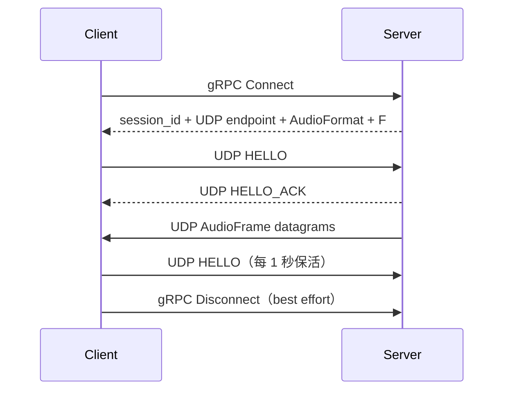

# Aqua

[English](README.md)  |  [中文](README_zh.md)

> 把一台设备正在播放的声音，实时、低延迟地串流到局域网里的另一台设备上。


[](https://github.com/aquawius/aqua)

Aqua 是一个局域网音频串流系统：Server 采集本机声音（系统混音或麦克风），Client 在另一台设备上实时播放。
音频走无压缩 PCM，不做转码，局域网下音质无损、延迟可控。

目前已经可以实际使用的形态：

- **Windows 桌面**：`aqua_server_cli` + `aqua_client_cli` 两个命令行程序，开箱即用；
- **Android 手机**：Kotlin/Compose App，作为接收端在手机上播放电脑的声音。

## 能做什么

- **把电脑声音串到手机或另一台电脑**：Server 默认采集系统默认输出设备的混音（loopback），手机连上就能听。
- **采集麦克风**：`--capture input` 即可切换为采集输入设备。
- **换设备不断流**：拔掉耳机、切换系统默认输出，两端都会自动把音频端点切换到新设备上——
  会话不中断、不需要重连。
- **指定设备**：也可以钉住某一台设备（`--device-id`），只要它还在就一直用它。
- **无压缩、无转码**：PCM 原样传输（S16LE / S24LE / S32LE / F32LE / U8），Server 不隐式重采样。
- **实时诊断**：Server / Client 每秒输出抖动、丢包、设备状态等指标；Android App 主页直接展示用户级指标卡。
- **Android 接收端**：播放设备选择（跟随系统或钉住某台设备，设备回归后自动切回）、前台服务后台播放、
  音频焦点处理、断线自动重连、高级参数与 CLI 对齐（抖动槽数 / HELLO 间隔 / UDP 端口覆盖 / 日志级别）。

## 技术特性

**音频与传输**

- Windows WASAPI 采集（`input` / `loopback`）与播放；无压缩 PCM：S16LE / S24LE / S32LE / F32LE / U8
- 变长 Capture Block 重切为定长 `AudioFrame`；按 MTU 自动推导安全的 `frame_count`
- Loopback 静默（quiescence）时合成静音补偿时间轴，且不创建第二个 Packetizer producer
- gRPC 控制面（`Connect` / `Disconnect`）+ 裸 UDP 数据面，音频热路径不使用 protobuf
- UDP `HELLO` / `HELLO_ACK` 握手建连，1 秒保活，session 超时自动回收
- **IPv4 / IPv6 双栈** literal 地址支持；Server 监听地址与通告给 Client 的 UDP 地址可独立设置
- `--force-udp-port` 适配 NAT / 端口映射部署

**播放质量**

- 固定容量、按 sequence 编址的 JitterBuffer：启动 pre-roll、基于 playout deadline 的迟到/缺帧处理
- Warning 区软校正：低水位重播 READY slot 减速、高水位跳槽加速；校正从 1 slot 起逐步增长且有上限
- Deadline correction 与 reanchor 提供硬恢复路径；缺帧输出静音，不阻塞播放 RT
- jitter / loss / reanchor / 静音 / 播放等完整诊断指标

**诊断与 CLI**

- Server / Client 每秒诊断 snapshot；WASAPI 采集 Active / Silent / Starved 状态诊断
- 设备枚举（含 endpoint 方向与默认格式）；Windows 控制台与系统错误的 UTF-8 处理
- 可选 JitterBuffer realtime debug log，用于短时开发调查

**Android**

- AAudio 播放后端：LOW_LATENCY / SHARED；编码与声道严格匹配 Server 契约，采样率允许系统重采样，
  framesPerCallback 自适应设备 burst
- C API（`aqua_capi`）：opaque handle、轮询式 state / diagnostics / connect_result 查询，生命周期串行契约
- Kotlin/Compose App：主页用户级指标卡、前台服务 + MediaStyle 通知、音频焦点、UI 层自动重连，
  高级参数与 CLI 对齐
- `libaqua.so` 由根 CMake 交叉编译，gRPC / protobuf / abseil 静态链入单库交付，含 JNI 动态注册

## 快速开始

### 环境要求

- CMake ≥ 4.2，vcpkg manifest 模式（`VCPKG_ROOT`）
- Windows：Visual Studio 2026
- Android（可选）：NDK（`ANDROID_NDK_HOME`）、JDK / Android SDK

### 构建与测试

```powershell
cmake --preset windows-x64-debug
cmake --build cmake_build/windows-x64-debug --config Debug
ctest --test-dir cmake_build/windows-x64-debug --build-config Debug --output-on-failure
```

Release 构建：

```powershell
cmake --preset windows-x64-release
cmake --build cmake_build/windows-x64-release --config Release
```

### 跑起来

Server 无参数即可启动（默认采集系统默认输出设备的混音，gRPC `50051` / UDP `50000`）：

```powershell
.\aqua_server_cli.exe
```

Client 只需要 Server 的 IP：

```powershell
.\aqua_client_cli.exe --server-ip 192.168.1.10
```

常用命令：

```powershell
.\aqua_server_cli.exe --help           # 全部参数
.\aqua_server_cli.exe --list-devices   # 枚举音频设备
.\aqua_client_cli.exe --help
.\aqua_client_cli.exe --list-devices
```

几个常见场景：

```powershell
# 采集麦克风而不是系统混音
.\aqua_server_cli.exe --capture input

# 钉住某台采集设备（先 --list-devices 查 device id）；该设备消失即停止，不会悄悄换设备
.\aqua_server_cli.exe --device-id "{...}"

# NAT / 端口映射部署：只覆盖 UDP 端口
.\aqua_client_cli.exe --server-ip 192.168.1.10 --force-udp-port 52000
```

### Android App

```powershell
# 1. 交叉编译 native 库并同步到 per-buildType jniLibs
powershell -ExecutionPolicy Bypass -File aqua_app/aqua_android/build_android.ps1

# 2. Gradle 打包 APK
cd aqua_app/aqua_android
.\gradlew.bat assembleDebug    # 或 assembleRelease
```

产物在 `aqua_app/aqua_android/app/build/outputs/apk/<debug|release>/`。
Release 签名从 `keystore.properties` 读取（不入 git，缺省回退 debug 签名）。
详细说明见 [BUILD.md](BUILD.md)。

## 平台支持

| 平台    | 采集                    | 播放    | 状态                                           |
|---------|-------------------------|---------|------------------------------------------------|
| Windows | WASAPI input / loopback | WASAPI  | ✅ 已实现                                       |
| Android | —                       | AAudio  | ✅ 播放已实现（capture 见 roadmap）              |
| Linux   | —                       | —       | 🟡 可编译，音频后端未实现                       |
| macOS   | —                       | —       | 🟡 可编译，音频后端未实现                       |

Linux/macOS 的 preset 只代表构建基础设施已就绪，不代表音频后端已完成。

---

## 工作原理

Aqua 把系统刻意拆成**轻量控制面**和**实时音频数据面**：



gRPC 只负责建/删会话和下发参数；UDP 每个 datagram 恰好承载一个完整 PCM `AudioFrame`，热路径上不用 protobuf；
Client 的 JitterBuffer 把不规则的网络到达重排成连续的播放时间轴。

```text
Server
  WASAPI Capture（RT / MMCSS）   ← CaptureManager 持有，故障时重建
        │  AudioBlock（变长 PCM 视图）
        ▼
  AudioPacketizer               ← 无独立线程，直接跑在采集 RT 线程上
        │  AudioFrame（定长 F 帧）
        ▼
  AudioFrameQueue（SPSC 交接：RT → 网络线程）
        ▼
  AudioNetworkDispatcher ──► UDP broadcast ──► Client
                                                  │  解码 + 源端点校验
                                                  ▼
                                            JitterBuffer（按 sequence 入槽，天然重排）
                                                  │  pull（回放 RT 回调）
                                                  ▼
                                            WASAPI / AAudio Playback   ← PlaybackManager 持有，故障时重建
```

**设备故障是"切换"而不是"停机"。** 两端各自按候选链就地重建音频端点（`CaptureManager` / `PlaybackManager`），
gRPC 会话、UDP 会话、协商格式和 sequence 时间线全部保留——切换允许出现 packet gap，但禁止 sequence 重置。
切换事务（stop → start）在控制线程执行，不进入实时路径；切换间隙由 Client 侧 JitterBuffer 的水位机制吸收。

路由语义两端对称：

- **跟随系统**（默认）：候选链 `[目标设备, 先前的实际设备, 系统默认]`，系统默认设备变化时自动跟随；
- **钉住设备**：Client 侧钉住的设备消失会先回退系统输出、设备回归后自动切回；
  Server 侧显式 `--device-id` 表示"只要这台设备"，设备消失即 Fatal 停止，不会静默降级到系统默认。

## 设计要点（维护者）

- **格式不可变**：一次 Server 运行期间 `AudioFormat` 与 `frame_count = F` 固定，由 gRPC 下发，Client 不自行推断；
  候选设备不原生支持会话格式即视为候选失败，不做转码。
- **一个 datagram 一个帧**：Audio wire header 9 字节，PCM payload 预算 1443 字节（按 IPv6 1500-byte MTU 推导）。
- **只有一层缓冲**：Client 只有 JitterBuffer，没有第二个 RingBuffer——两个水位、两个消费时钟会让漂移行为无法解释。
- **RT 路径纪律**：实时线程只做有界工作（内存拷贝 / 原子 / 队列操作），禁止阻塞、堆分配、同步 I/O。
  `AudioPacketizer` 没有私有线程，`push()` 直接运行在 MMCSS `Pro Audio` 采集线程上。
- **JitterBuffer 以 slot 计容量**：pre-roll 锚定 50% 水位启动；低水位重播 READY slot 减速、高水位跳槽加速；
  软校正逐步增长且有上限；deadline correction 与 reanchor 提供硬恢复路径；缺帧输出静音而不是阻塞播放。
- **有界重试**：10 秒窗口内最多 3 次自动 restart，超限才停止会话，防止插拔风暴。
- **只认设备事件**：静音、低能量不作为"设备坏了"的判据（WASAPI loopback 静默时会合成静音帧补偿时间轴）。
- **安全边界**：UDP HELLO 无认证、Audio datagram 无身份校验、gRPC 为明文——Aqua 是可信局域网协议，
  不要直接暴露到公网。详见 `aqua_core/doc/security_and_deployment.md`。

## 文档

Core 文档描述的是**当前源码已经实现的系统**，是维护本项目的首选入口（导航见
[aqua_core/doc/README.md](aqua_core/doc/README.md)）：

| 文档                                                                                               | 作用                                          |
|----------------------------------------------------------------------------------------------------|-----------------------------------------------|
| [architecture.md](aqua_core/doc/architecture.md)                                                   | 总体架构、边界、数据流、生命周期              |
| [flow_model.md](aqua_core/doc/flow_model.md)                                                       | 连接、稳态、故障与关闭流程                    |
| [audio_design.md](aqua_core/doc/audio_design.md)                                                   | 音频单位、格式、采集/播放语义、MTU            |
| [buffer_design.md](aqua_core/doc/buffer_design.md)                                                 | JitterBuffer 几何、软校正、deadline、reanchor |
| [protocol.md](aqua_core/doc/protocol.md)                                                           | gRPC/UDP 协议、session、wire format           |
| [capture_switching_design.md](aqua_core/doc/capture_switching_design.md)                           | Server 采集设备切换设计决议                   |
| [playback_switching_design.md](aqua_core/doc/playback_switching_design.md)                         | Client 播放设备切换设计决议                   |
| [devices_and_format.md](aqua_core/doc/devices_and_format.md)                                       | 设备值对象、路由与格式的关系                  |
| [threading_and_lifecycle.md](aqua_core/doc/threading_and_lifecycle.md)                             | 线程所有权、callback 与 stop 顺序             |
| [design_decisions.md](aqua_core/doc/design_decisions.md)                                           | 已冻结的设计决策                              |
| [configuration_reference.md](aqua_core/doc/configuration_reference.md)                             | 当前默认值与协议固定项                        |
| [diagnostics.md](aqua_core/doc/diagnostics.md)                                                     | 日志与诊断指标体系                            |
| [testing.md](aqua_core/doc/testing.md)                                                             | 测试策略与回归范围                            |
| [build_and_release.md](aqua_core/doc/build_and_release.md)                                         | 构建、preset、依赖与发布检查                  |
| [operations_and_troubleshooting.md](aqua_core/doc/operations_and_troubleshooting.md)               | 运行期排障                                    |
| [project_scope_and_requirements.md](aqua_core/doc/project_scope_and_requirements.md)               | 项目范围、非目标与产品不变量                  |
| [security_and_deployment.md](aqua_core/doc/security_and_deployment.md)                             | 信任模型与部署限制                            |
| [android_roadmap.md](aqua_core/doc/android_roadmap.md)                                             | Android 分层、里程碑与验收标准                |
| [aaudio_backend_design.md](aqua_core/doc/aaudio_backend_design.md)                                 | AAudio 格式协商与设备路由决议                 |
| [modules/](aqua_core/doc/modules/source_map.md)                                                    | 源码级模块文档（source_map 为导航入口）       |
| [aqua_app/cli/doc/README.md](aqua_app/cli/doc/README.md)                                           | CLI 专题文档                                  |

文档之间出现冲突时，以源码和测试为准。

## 项目结构

```text
aqua/
├── CMakeLists.txt / CMakePresets.json / vcpkg.json
├── aqua_core/
│   ├── include/aqua/       # Core 公共头（c_api/ 为稳定 C 边界）
│   ├── src/                # Core 实现（c_api/ 含 Android JNI 桥）
│   ├── proto/              # gRPC / protobuf schema
│   ├── tests/              # GoogleTest
│   └── doc/                # Core 设计与维护文档
└── aqua_app/
    ├── aqua_android/       # Android App（Kotlin/Compose + build_android.ps1）
    └── cli/                # Server / Client CLI（cli_parser + 专题文档）
```

构建上 Server 与 Client 分开编译（`aqua_server_core` / `aqua_client_core`），平台后端依赖不会传播到另一端；
`aqua_capi` 默认关闭，Android preset 打开，产物为单个静态链接了 gRPC/protobuf/abseil 的 `libaqua.so`。

## 范围与非目标

当前 Core 有意保持克制：

- 不做音频 codec / 压缩（裸 PCM）
- 不做自动重采样 / 转码
- 不支持 WASAPI / AAudio Exclusive 模式
- 不支持运行期切换**音频格式**（设备可切换，格式不可变）
- 不提供运行期修改 Server 采集目标的接口（切换目标即 CLI 配置）
- 不做 STUN/TURN/ICE NAT 穿透
- 无认证、无加密，不是公网安全协议
- Client 只有 JitterBuffer 一层缓冲

Linux / macOS 后端属于未来里程碑，新增实现应复用现有 Core 契约，而不是再造第二套 Runtime 架构。
Android 后续里程碑（capture 等）见 `aqua_core/doc/android_roadmap.md`；Android 系统 API 不提供 OUTPUT loopback，
内录能力需另行设计。

## 开发说明

项目中包含 AI 辅助编写并经人工复核的代码和文档。维护时应以当前源码、测试和 Core 技术文档描述的实现状态为准。

## 许可证

依据 [MIT 许可证](LICENSE) 分发。
