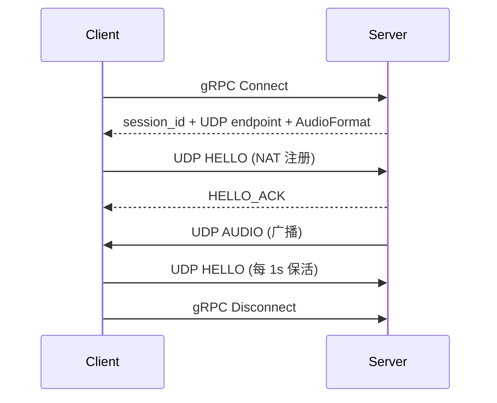

# Aqua

> 跨平台低延迟网络音频共享。在一台设备上采集 PCM 音频，实时传输到另一台设备回放。


Aqua 让音频在网络上的设备之间流动——例如把电脑的音频串流到手机，或串流到另一台电脑。它追求 **低延迟** 与 **简单**：一个轻量的
gRPC 控制面 + 一条裸 UDP 音频通路。

## ✨ 特性

**音频**

- WASAPI 回环采集（Windows）与 AAudio 播放（Android）
- 无压缩 PCM —— S16LE / S32LE / F32LE / S24LE / U8
- SPSC 环形缓冲，把实时音频回调与网络隔离

**网络**

- 裸 UDP 数据面 —— 紧凑的二进制包，热路径不使用 protobuf
- gRPC 控制面（仅 `Connect` / `Disconnect`）
- 一层 NAT 穿透（UDP `HELLO` 握手 + 保活，无 STUN/TURN/ICE）

**播放质量**

- Jitter Buffer：基于 playout deadline 的乱序重排、去重、迟到/丢包处理
- 自适应目标延迟 + 丢包隐藏（PLC）
- 回放速率漂移诊断（ppm）

**集成**

- 稳定的 C API（`include/aqua.h`），连接 C++ 核心与任意 UI
- Android 前台媒体服务 —— MediaSession、通知栏控制、音频焦点

## 工作原理



> **gRPC 管连接，SessionManager 管状态，UDP 管音频，Audio Backend 管设备，Client 管自己的格式转换。**

Server 是纯转发器——不做重采样、转码或混音。

## 平台支持

| 平台    | 采集             | 播放               | 状态      |
|---------|------------------|--------------------|-----------|
| Windows | WASAPI 回环      | WASAPI             | ✅        |
| Android | 麦克风（规划中） | AAudio             | ✅ 仅播放 |
| Linux   | —                | PipeWire（规划中） | ⬜        |
| macOS   | —                | —                  | ⬜ 规划中 |

## 快速开始

### 环境要求

- CMake ≥ 4.2 与 [vcpkg](https://vcpkg.io)（依赖见 `vcpkg.json`）
- Windows：Visual Studio；Android：NDK + SDK

### 构建

```powershell
# Windows 桌面（server + client CLI）
cmake --preset windows-x64-debug
cmake --build cmake_build/windows-x64-debug --config Debug
ctest --test-dir cmake_build/windows-x64-debug --build-config Debug --output-on-failure

# Android（先编 native 库，再打 APK）
powershell -ExecutionPolicy Bypass -File Android/build_android.ps1
cd Android; .\gradlew.bat assembleDebug    # 或 assembleRelease
```

### 运行

```powershell
# Server
aqua_server --bind-ip 0.0.0.0 --rpc-port 50051 --udp-port 50000

# Client（UDP 端口由 gRPC Connect 返回，无需 CLI 指定）
aqua_client --server-ip <server_ip> --server-rpc-port 50051
```

## 技术栈

| 层级       | 技术                                 |
|------------|--------------------------------------|
| 核心       | C++23、CMake、vcpkg                  |
| 数据面     | Asio（UDP）                          |
| 控制面     | gRPC + Protocol Buffers              |
| 音频       | WASAPI（Windows）、AAudio（Android） |
| 桌面 UI    | Qt6（规划中）                        |
| Android UI | Kotlin + Jetpack Compose             |
| 日志       | spdlog                               |
| 测试       | GoogleTest                           |

## 项目结构

```text
aqua/
├── include/aqua.h            # C API 头文件
├── proto/                    # gRPC 控制面协议
├── src/
│   ├── core/                 # 平台无关核心 + 音频后端
│   ├── app/cli/              # server/client CLI
│   └── android/jni/          # JNI 桥接
├── Android/                  # Android App（Kotlin/Compose）
├── tests/                    # 单元与集成测试
└── doc/                      # 设计文档
```

## 文档

| 文档                                                     | 说明         |
|----------------------------------------------------------|--------------|
| [build.md](build.md)                                     | 构建指南     |
| [doc/architecture.md](doc/architecture.md)               | 架构与设计   |
| [doc/protocol.md](doc/protocol.md)                       | 线缆协议     |
| [doc/modules.md](doc/modules.md)                         | 模块与接口   |
| [doc/roadmap.md](doc/roadmap.md)                         | 里程碑与状态 |
| [doc/diagnostics_manager.md](doc/diagnostics_manager.md) | 诊断         |

## 路线图

PCM over UDP 已端到端稳定。进行中：Linux（PipeWire）、Android 麦克风采集、Qt6 桌面 UI、Opus
编码。详见 [doc/roadmap.md](doc/roadmap.md)。

## 其他须知

> **注意：** 本项目的部分模块由 AI 编写, 由人工复核。

## 许可证

依据 [MIT 许可证](LICENSE) 分发。
