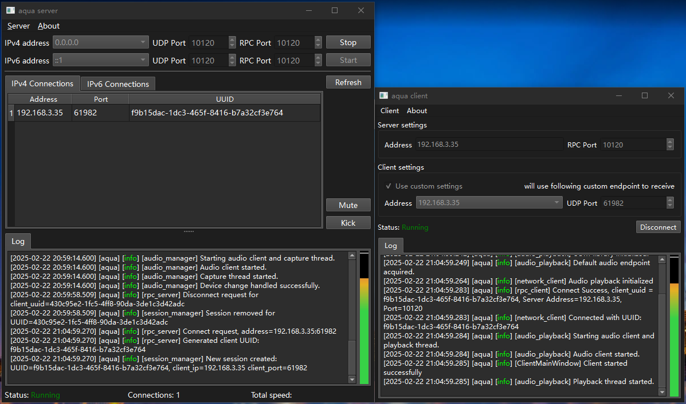
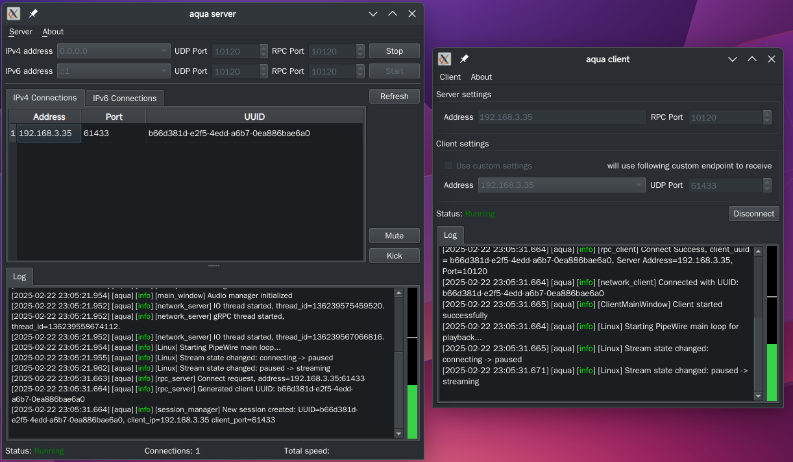
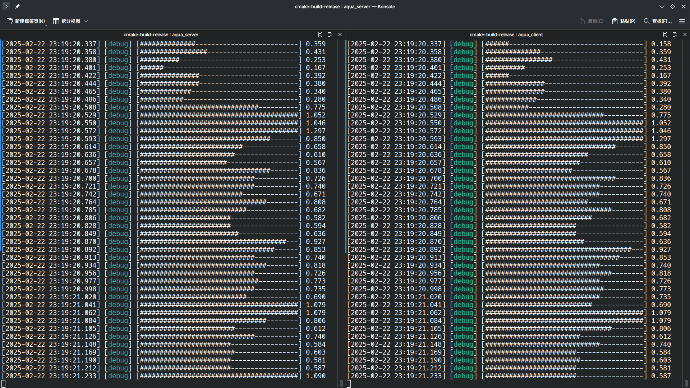
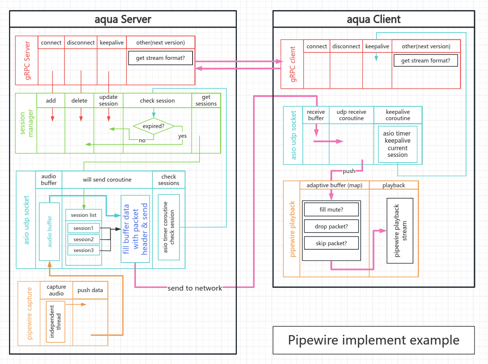

# aqua

### `aqua` - A Cross-Platform Real-Time Audio Sharing Software

> This project captures audio streams from various systems, transmits them over the network to another system as audio
> input for playback.
> The goal is to achieve audio stream sharing across the vast majority of operating systems.

This is aquawius' first moderately sized C++ project. I have high hopes for it, hence naming it `aqua` after the first
half of my name. I also hope `aqua` remains evergreen, just like the color this word represents.

> Attention: this `readme.md` translate by DeepSeek AI, may some translation is wrong. See `readme_zh.md`.

##### If you find this useful, please star the project. Issues are welcome, and pull requests would delight me!

------

#### 1. Project Overview

The idea of audio sharing originated during my university years, but it remained shelved until now, finally taking
shape—a tribute to my college life.

The project was initially inspired by [audio-share](https://github.com/mkckr0/audio-share), which implemented audio
streaming to Android devices. I referenced parts of its code (especially the ASIO coroutine section) during the early
stages. Special thanks to the audio-share project and its contributors.

The system consists of a **server** and **client**. In short:
**The server captures the system's audio stream and sends it over the network to one or more clients for playback.**

Key features of `aqua`:

> 1. **Cross-platform support**: Versions for Windows and Linux with interoperability (e.g., capture on Linux and play
     on Windows, or vice versa).
> 2. **Low-latency audio transmission**: Estimated under 20ms on Linux and 50ms on Windows.
> 3. **GUI (Qt) and CLI support**: No more wrestling with terminal windows.
> 4. **Network resilience**: Client-side adaptive buffering to combat jitter.
> 5. **Automatic default device switching**: Seamlessly switches capture/playback streams when default devices change.
> 6. **Visual volume indicator**: Monitor audio capture/playback status.

Qt6 version. (Windows/Linux)

Console version. (-V to enable verbose mode)

#### 2. Usage

Deploy the server on the sharing device and the client on the playback device. Both must have bidirectional network
access.

##### Server Setup:

- Run `aqua-server`, optionally binding to a specific IP (default: LAN IP) and port (default: 10120).
- For cross-subnet use, bind to `0.0.0.0`.

##### Client Setup:

- Run `aqua-client`, specifying the server's IP and RPC port (default: 10120).
- Provide the client's local IP (must be reachable by the server) and port (default: random between 49152-65535).
- Qt GUI users: Check `Use custom settings` to specify IP/port.

In console version, you can use `--help` or `-h` to see usage.

You should now hear audio captured by the server.

#### 3. Technical Architecture

**Shared Components**:

- gRPC services
- Network layer
- Capture/playback services

**Client-Specific**:

- Adaptive buffer

**Server-Specific**:

- Session management

#### 4. Current Status

##### Completed Features

###### aqua Server

> - Linux PipeWire capture (via Sink, native stream routing)
> - Windows WASAPI capture with stream routing (fixed format)
> - IPv4 support
> - Session management

###### aqua Client

> - Linux PipeWire playback
> - Windows WASAPI playback with stream routing (fixed format)
> - IPv4 support
> - Keep-alive mechanism (sync with server sessions)
> - Adaptive buffering (network jitter mitigation)

##### Pending/Limitations

> - IPv6 support
> - NAT traversal improvements (current design assumes LAN; client IP/port required)
> - ~~GUI support (Qt6 now available for `aqua-qt-server` and `aqua-qt-client`)~~~~~~~~~~~~~~~~~~~~~~~~~~~~~~~~~~~~~~~~
> - Android client (low priority; overlaps with `audio-share`)
> - gRPC timeout handling (delayed client exit on disconnects)
> - **Fixed audio format on Windows**: 48kHz, 2ch, 16-bit (deviation causes crashes)

------

###### Libraries Used

- [spdlog](https://github.com/gabime/spdlog) & [fmt](https://github.com/fmtlib/fmt)
- [cxxopts](https://github.com/jarro2783/cxxopts)
- [Boost](https://www.boost.org/)
- [gRPC](https://github.com/grpc/grpc) & [Protobuf](https://github.com/protocolbuffers/protobuf)
- [PipeWire](https://www.pipewire.org/)
- [Qt6](https://www.qt.io/) Open Source

Grateful acknowledgment to these excellent libraries and their contributors.

##### Licensing

The licensing model is under consideration. Stricter terms from dependencies will take precedence where applicable.
