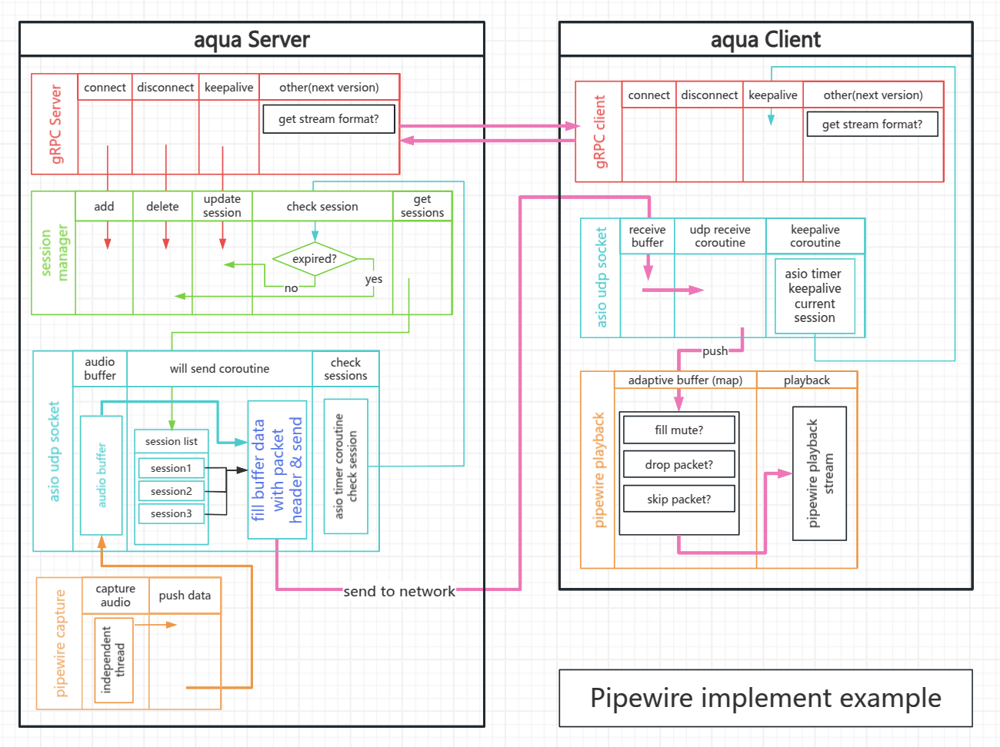

# aqua

### `aqua` 是一个跨平台实时音频共享软件

> 这个项目捕获各种系统的音频流，通过网络流传输给另一个系统作为音频输入并播放
>
> 目标是实现绝大多数系统的音频流共享

这是作者aquawius的第一个有点规模的C++项目，我对这个项目寄予厚望，因此，以我名字的前半部分命名`aqua`，也希望`aqua`
像这个单词表示的颜色一样长青

##### 如果对你有用，请star本项目，欢迎issue，如果有能力pull requests，我会很高兴的

---

#### 1. 项目介绍

在大学期间就已经有想法做音频共享，只是一直咕到了现在才初具雏形，算是给我的大学生活一个交代

最初项目受到[audio-share](https://github.com/mkckr0/audio-share)
项目的启发，[audio-share](https://github.com/mkckr0/audio-share)
实现了音频流到Android的播放，他的项目非常好，在项目初期我参考了它的一部分代码（尤其是asio协程部分），在此对audio-share项目和其贡献者表示感谢

#### 2. 使用方式

项目分为服务器和客户端，你需要下载服务器和客户端，分别部署在两台你想要共享音频的设备上，两个设备必须能够双向通信

共享端启动`aqua服务器`，指定绑定的IP地址（如果不指定地址，优先使用默认内网IP地址）和端口（默认10120），服务器将选择默认的设备监听音频并发送到网络上，如果有跨网段需要，请绑定到地址
`0.0.0.0`.

播放端启动`aqua客户端`，指定服务器的IP地址（必须提供）和端口（默认使用10120），和本机使用的IP地址（如果不指定地址，优先使用默认内网IP地址）和端口（默认使用49152-65535的随机端口）

然后你就可以听到来自服务器捕获的音频了

#### 3. 技术架构

客户端和服务器都有的：gRPC服务，网络服务，捕获/回放服务

客户端特有的：自适应缓冲区

服务器特有的：会话管理

#### 4. 目前项目状态

##### 完成的部分

###### aqua服务器

> - [x] Linux pipewire捕获支持，（捕获Sink，PipeWire自带流路由）
>
> - [x] Windows 音频会话 API (WASAPI) 捕获支持, 流路由支持(不能更改流格式)
>
> - [x] IPv4支持
>
> - [x] 会话管理

###### aqua客户端

> - [x] Linux pipewire播放支持
>
> - [x] Windows 音频会话 API (WASAPI) 播放支持, 流路由支持(不能更改流格式)
> 
> - [x] IPv4支持
>
> - [x] 保活机制（和服务器会话管理对应）
>
> - [x] 自适应缓冲（抗网络波动能力）
>

##### 没完成/受到限制的部分

> - [ ] 考虑支持IPv6
>
>   
>
> - [ ] 似乎在公网环境下，NAT客户端一般不需要提供IP和端口号信息，目前仅仅在内网测试，在设计上有缺陷（需要客户端的ip地址和端口），server需要部分重构，不影响局域网用户
>
>   
>
> - [x] ~~目前服务器是项目`aqua`，客户端是`aqua-client`，后续会合并`aqua-client`到`aqua`~~
>
>   aqua已经完成`aqua-server`和`aqua-client`项目合并
>
>   
>
> - [x] ~~目前仅仅支持Linux pipewire捕获和pipewire播放，Windows捕获支持，Windows播放暂时没有实现（下一个版本）~~ 
>
>   pipewire和WASAPI已经得到捕获和播放的支持
>
>   
>
> - [ ] **音频流的格式目前不可变，Windows端需要提前指定为48000位，2通道, 16位（否则会引发未定义行为而崩溃）**
>
>   
>
> - [ ] 通用图形用户界面支持（Qt6）
>
>   
>
> - [ ] 可能不做Android端（现在的我不会android开发，而且和`audio-share`的功能有一部分重合，虽然我想做全平台项目，仍需谨慎考虑）
>
>   
>
> - [ ] 目前对gRPC的通信有强依赖，gRPC在通信超时的时候不能在短时间内通知网络线程，会导致如果通信中断，客户端会等待相对长的时间才有退出动作
>
>   

---

###### 目前项目使用到的库有

- [spdlog](https://github.com/gabime/spdlog)和[fmt](https://github.com/fmtlib/fmt)（spdlog绑定）
- [cxxopts](https://github.com/jarro2783/cxxopts)
- [Boost](https://www.boost.org/)
- [gRPC](https://github.com/grpc/grpc)和[Protobuf](https://github.com/protocolbuffers/protobuf)
- [PipeWire](https://www.pipewire.org/)

在此感谢这些美妙的库和他们的贡献者

##### 开源协议

目前使用什么协议还没想好，我对于开源协议也不是很懂

如果我使用的相关库有更严格的协议，那么本项目使用它的协议的严格部分